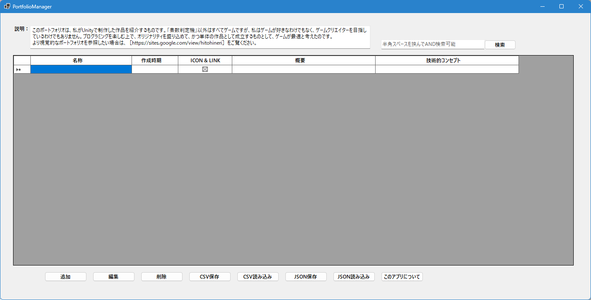
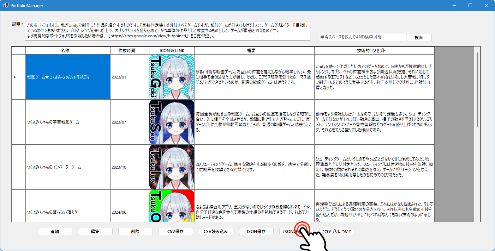
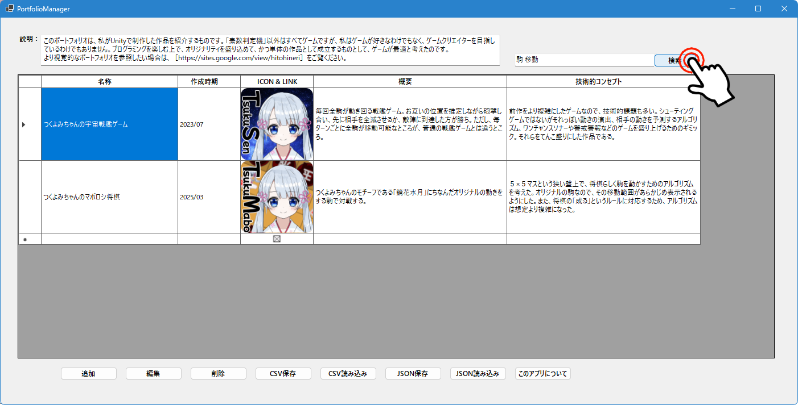
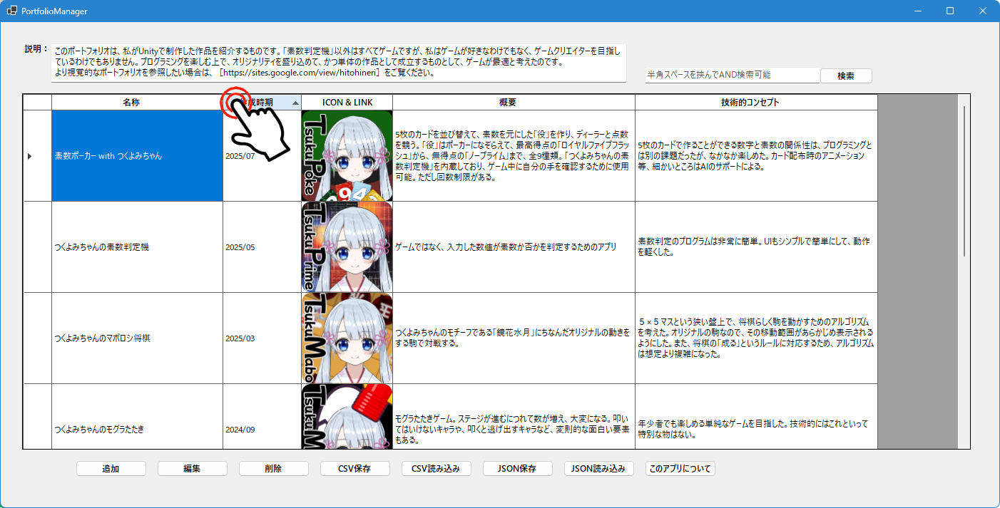
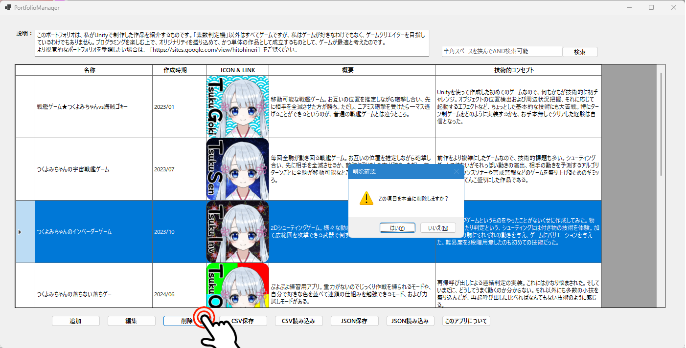
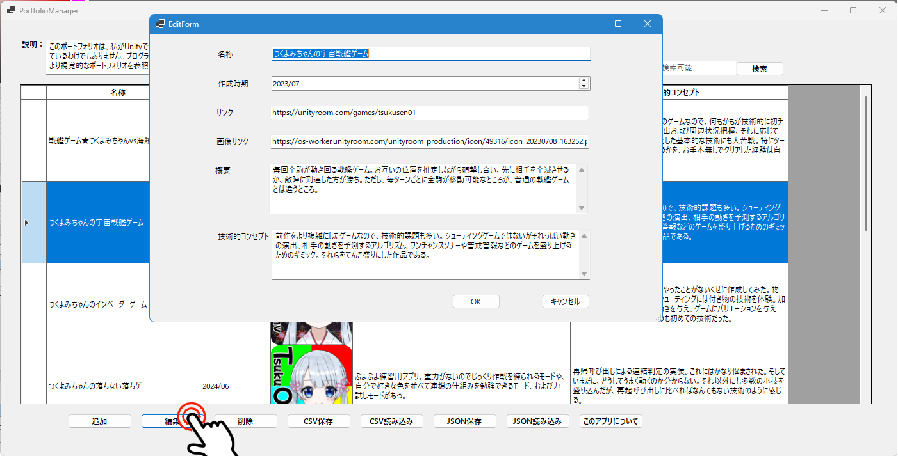

# 📁 PortfolioManager v1.0.0

Windows Forms で開発したポートフォリオ作成支援ツールです。  
自作アプリケーションの情報（名称・作成時期・アイコン・格納URL・概要・技術的コンセプト）を表形式で整理・管理できます。

---

## 📝 概要

このPortfolioManagerは、自作アプリケーションの一覧表を作成・編集・保存することで、ポートフォリオとして活用できるツールです。  
以下の情報を一元管理し、視覚的にわかりやすく表示します：

| 項目         | 説明                                           |
|--------------|------------------------------------------------|
| 名称         | アプリや作品のタイトル                         |
| 作成時期     | 年月単位での作成日（例：2026/02）              |
| アイコン     | 作品のイメージ画像（128×128）                  |
| 格納場所     | Unityroomなど、作品が公開されているURL         |
| 概要         | アプリの簡単な説明                             |
| 技術的コンセプト | 使用技術や設計方針などの技術的なポイント     |

---

## ⚙ 主な機能

- 🔍 **全文AND検索**（名称・概要・技術的コンセプトに対応）
- 🔃 **並び替え機能**（名称・作成時期で昇順／降順の切り替え）
- ➕ **データの追加・編集・削除**
- 💾 **CSV形式での保存・読み込み**
- 🔐 **JSON形式（AES暗号化）での保存・読み込み**
- ↔ **列幅の可変表示**
- 🌐 **アイコンをクリックすると、作品の公開ページ（例：Unityroom）をブラウザで開く**

---

## 🛠 技術的背景

- **開発環境**：Visual Studio 2026  
- **使用言語**：C#  
- **UIフレームワーク**：Windows Forms (.NET 10)

---

## 🚀 実行方法

1. `.NET ランタイムは不要`（自己完結型でビルド済み）
2. [PortfolioManager.zip](https://github.com/WS-HITOHINERI/PortfolioManager/releases/download/v1.0.0/PortfolioManager.zip) をダウンロードして展開
3. `PortfolioManager_v.1.0.0` フォルダー内の `PortfolioManager.exe` を実行

### 📂 サンプルデータの読み込み（任意）

- **CSV読み込み**：`MyPortfolio_20260224.csv`
- **JSON読み込み**：`MyPortfolio_20260224.json`（暗号化済み）

---

## 🖼 スクリーンショット

### 📋 スタート画面

### 📋 メイン画面（一覧表示）

### 🔍 検索機能

### 🔍 ソート機能

### 🔍 削除機能

### ✏️ 追加・編集画面

---

## 📄 ライセンス

このプロジェクトは [MIT License](LICENSE) のもとで公開されています。

---

## 👤 制作者

- **名前**：HITOHINERI
- **GitHub**：[github.com/WS-HITOHINERI](https://github.com/WS-HITOHINERI/PortfolioManager)

---

## 💬 補足

- 本アプリは個人のポートフォリオ作成支援を目的として作成されました。
- ご自由にダウンロード・改変・再配布していただいて構いません。
- ご意見・ご感想・改善提案など大歓迎です！

